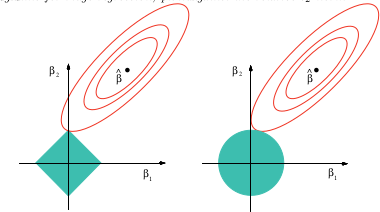

# Lecture 6. Regression problem: quality measures and regularization 

## Reminder

- Regression problem statement
- Linear least squares
- Nonlinear least squares
- Gauss-Newton and Levenberg-Marquardt methods

## Today lecture

- Regression quality measures
- What to do when the design matrix is not full-rank?
- Probabilistic interpretation

## Quality measures

- Train and test loss
- Coefficient of determination $R^2$
$$
R^2 = 1 - \frac{S_{res}}{S_{tot}},
$$
where $S_{res} = \| y - \hat{y} \|^2_2$ and $S_{tot} = \| y - \bar{y}\|^2_2$.
Closer to 1, better the model

Cons: $R^2$ increases when more features are added

- Scikit-learn uses this measure to score the regression model 
- Attempt to treat the cons: adjusted $R^2$ &mdash; $\bar{R}^2$
$$
\bar{R}^2 = 1 - (1 - R^2) \frac{n-1}{n-m}
$$

Here $x \in \mathbb{R}^n, y \in \mathbb{R}^m$

### AIC and BIC - the lower the better

- Akaike Information Criterion
$$
AIC = n \log \left(\frac{S_{res}}{n}\right) + 2m,
$$
where $n$ is a number of samples, $m$ is a number of features
- Bayesian Information Criterion
$$
BIC = n \log \left(\frac{S_{res}}{n}\right) + 2m \log(n)
$$

## Statistical tests

- $t$-test

Test significance of every feature in explanation of the target vector:

$$
H_0: w_j = 0 \quad H_1: w_j \neq 0
$$

- $F$-test

Test if the linear model is adequate

$$
H_0: w_1, w_2, \ldots, w_n = 0 \quad H_1: \exists k: \; w_k \neq 0 
$$

- Normality of the residuals

Again,

$$
\|Xw - y\|_2^2 \to \min_w
$$

Normal equation is the solution:

$$
w^* = (X^*X)^{-1}X^* y = X^\dagger y
$$

Given the solution let's turn it back to the problem:

$$
\|X(X^*X)^{-1}X^* y - y\|_2^2 \to \min_w
$$

$$
\|\Pi y - y\|_2^2 \to \min_w
$$

Where $\Pi = X(X^*X)^{-1}X^*$ is the projector matrix. It means, that least squares is just the projection of $y$ to the linear hull of columns of $X$ :)

Let us introduce covariation matrix $\Sigma = X^* X$ (Note, that if all features are normalized, it is just correlation matrix). 
What should we do if its condition number $\mu(\Sigma) = \dfrac{\lambda_{max}}{\lambda_{min}}$ is huge?

## Multicollinearity

**Definition.** The phenomenon of linear dependencies between features is called *multicollinearity*.

**Corollary.** The matrix $X^{\top}X$ is singular and normal equation can not be solved as it is. 

**Q:** how to deal with this problem?

## Regularization

**Definition. (not formal)** Regularization is a process of introduction to the model additional information to solve incorrect problems

Examples:
- improve stability by changing objective function
- provide uniqueness of the solution by adding constraints
- transform objective function to provide finite solution

### Tikhonov regularization (Ridge or $\ell_2$)

$$
\min_w \|Xw - y \|^2_2 + \alpha\|w\|^2_2, \quad \alpha > 0
$$

The solution changes:

$$
w^* = (X^*X + \alpha I)^{-1}X^* y
$$

All the eugunvalues of $\Sigma$ now increased to $\alpha$, but the eigenvectors are still the same. Let us also look to the trace of projection matrix $\Pi$ under such transformation:

Before:
$$
\text{tr}\;\Pi =\text{tr}\; X(X^*X)^{-1}X^* = \text{tr}\; X^*X(X^*X)^{-1} = \text{tr}\; I = n 
$$

After:
$$
\text{tr}\;\Pi = \text{tr}\; X(X^*X + \alpha I)^{-1}X^* = \text{tr}\; \text{diag}\; \dfrac{\lambda_i}{\lambda_i + \alpha} = \sum_i \dfrac{\lambda_i}{\lambda_i + \alpha} \leq n 
$$

#### Lasso ($\ell_1$)

$$
\min_w \|Xw - y \|^2_2 + \alpha\|w\|_1, \quad \alpha > 0
$$

Specifics:
- nondifferential but convex objective function
- relaxation of the $\ell_0$ "norm"
- sparse solution

### Ridge vs. Lasso


### Elastic Net

$$
\min_w \|Xw - y \|^2_2 + \alpha \rho\|w\|_1 + \alpha\frac{1-\rho}{2}\| w \|^2_2, \quad \rho \in [0, 1], \alpha > 0
$$

Specifics:
- combination of Lasso and Ridge
- more stable than Lasso

### General form of objectives in machine learning
$$
\min_w \ell(w|X, y) + R(w),
$$
where $\ell(w|X, y) = \sum\limits_{i=1}^m \ell_i(w|x_i, y_i)$ is a loss function and $R(w)$ is a regulaization term

- The objectives of such structure is called *composite* functions.
- For this structure there exist special optimization approaches and theory
- Since loss is a sum of loss for every sample, *distributed optimization* is active too

## Probability interpretation

- Maximum likelihood estimation
- Normal distributed residuals - linear least squares problem
- Laplace distributed residuals - MAE minimization
- Bayesian methodology - later in the course

Let's see to logistic regression example


```python
import pandas as pd
import numpy as np
from sklearn import preprocessing
import matplotlib.pyplot as plt 
plt.rc("font", size=14)
from sklearn.linear_model import LogisticRegression
from sklearn.cross_validation import train_test_split
import seaborn as sns
sns.set(style="white")
sns.set(style="whitegrid", color_codes=True)
```

    C:\Users\brati\Anaconda3\lib\site-packages\sklearn\cross_validation.py:41: DeprecationWarning: This module was deprecated in version 0.18 in favor of the model_selection module into which all the refactored classes and functions are moved. Also note that the interface of the new CV iterators are different from that of this module. This module will be removed in 0.20.
      "This module will be removed in 0.20.", DeprecationWarning)


```python
data = pd.read_csv('../files/banking.csv', header=0)
data = data.dropna()
print(data.shape)
print(list(data.columns))
```

    (41188, 21)
    ['age', 'job', 'marital', 'education', 'default', 'housing', 'loan', 'contact', 'month', 'day_of_week', 'duration', 'campaign', 'pdays', 'previous', 'poutcome', 'emp_var_rate', 'cons_price_idx', 'cons_conf_idx', 'euribor3m', 'nr_employed', 'y']


```python
sns.countplot(x='y',data=data, palette='hls')
plt.show()
```


```python
data.isnull().sum()
```


    age               0
    job               0
    marital           0
    education         0
    default           0
    housing           0
    loan              0
    contact           0
    month             0
    day_of_week       0
    duration          0
    campaign          0
    pdays             0
    previous          0
    poutcome          0
    emp_var_rate      0
    cons_price_idx    0
    cons_conf_idx     0
    euribor3m         0
    nr_employed       0
    y                 0
    dtype: int64


```python
sns.countplot(y="job", data=data)
plt.show()
```


```python
sns.countplot(x="marital", data=data)
plt.show()
```


```python
sns.countplot(x="default", data=data)
plt.show()
```


```python
sns.countplot(x="housing", data=data)
plt.show()
```


```python
sns.countplot(x="loan", data=data)
plt.show()
```


```python
sns.countplot(x="poutcome", data=data)
plt.show()
```


```python
data.drop(data.columns[[0, 3, 7, 8, 9, 10, 11, 12, 13, 15, 16, 17, 18, 19]], axis=1, inplace=True)
```


```python
data2 = pd.get_dummies(data, columns =['job', 'marital', 'default', 'housing', 'loan', 'poutcome'])
```


```python
data2.drop(data2.columns[[12, 16, 18, 21, 24]], axis=1, inplace=True)
data2.columns
```


    Index(['y', 'job_admin.', 'job_blue-collar', 'job_entrepreneur',
           'job_housemaid', 'job_management', 'job_retired', 'job_self-employed',
           'job_services', 'job_student', 'job_technician', 'job_unemployed',
           'marital_divorced', 'marital_married', 'marital_single', 'default_no',
           'default_yes', 'housing_no', 'housing_yes', 'loan_no', 'loan_yes',
           'poutcome_failure', 'poutcome_nonexistent', 'poutcome_success'],
          dtype='object')


```python
sns.heatmap(data2.corr())
plt.show()
```


```python
X = data2.iloc[:,1:]
y = data2.iloc[:,0]
X_train, X_test, y_train, y_test = train_test_split(X, y, random_state=0)
```


```python
X_train.shape
```


    (30891, 23)


```python
classifier = LogisticRegression(random_state=0)
classifier.fit(X_train, y_train)
```


    LogisticRegression(C=1.0, class_weight=None, dual=False, fit_intercept=True,
              intercept_scaling=1, max_iter=100, multi_class='ovr', n_jobs=1,
              penalty='l2', random_state=0, solver='liblinear', tol=0.0001,
              verbose=0, warm_start=False)


```python
y_pred = classifier.predict(X_test)
from sklearn.metrics import confusion_matrix
confusion_matrix = confusion_matrix(y_test, y_pred)
print(confusion_matrix)
```

    [[9046  110]
     [ 912  229]]


```python
print('Accuracy of logistic regression classifier on test set: {:.2f}'.format(classifier.score(X_test, y_test)))
```

    Accuracy of logistic regression classifier on test set: 0.90


```python
from sklearn.metrics import classification_report
print(classification_report(y_test, y_pred))
```

                 precision    recall  f1-score   support
    
              0       0.91      0.99      0.95      9156
              1       0.68      0.20      0.31      1141
    
    avg / total       0.88      0.90      0.88     10297
    


```python
from sklearn.decomposition import PCA
X = data2.iloc[:,1:]
y = data2.iloc[:,0]
pca = PCA(n_components=2).fit_transform(X)
X_train, X_test, y_train, y_test = train_test_split(pca, y, random_state=0)

plt.figure(dpi=120)
plt.scatter(pca[y.values==0,0], pca[y.values==0,1], alpha=0.5, label='YES', s=2, color='navy')
plt.scatter(pca[y.values==1,0], pca[y.values==1,1], alpha=0.5, label='NO', s=2, color='darkorange')
plt.legend()
plt.title('Bank Marketing Data Set\nFirst Two Principal Components')
plt.xlabel('PC1')
plt.ylabel('PC2')
plt.gca().set_aspect('equal')
plt.show()
```


```python
ans = np.linalg.svd(X_test @ X_test.T)
```


```python
plt.plot(ans[1][:20])
```


    [<matplotlib.lines.Line2D at 0x1ce53214080>]


```python
X_test.shape
```


    (10297, 2)


### Recap

- Quality mesures for regression problem
- Multicollinearity and regularization
- Probabilistic interpretation
