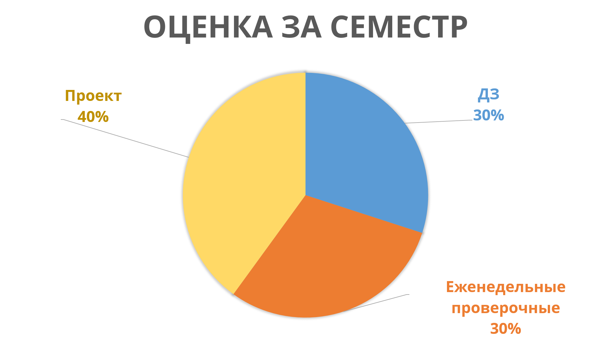
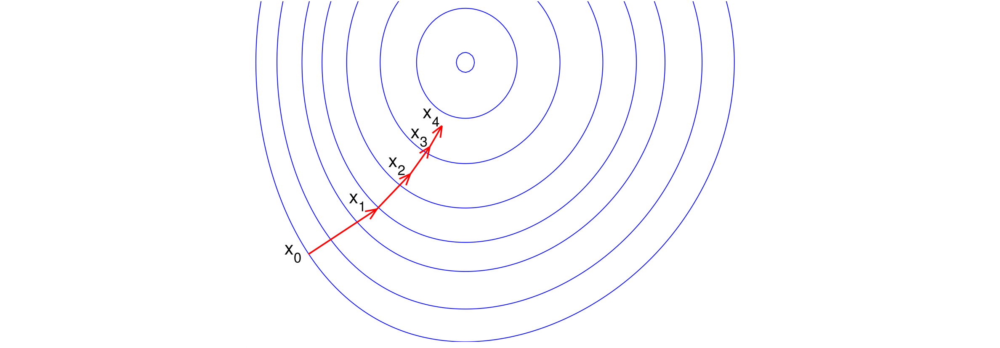
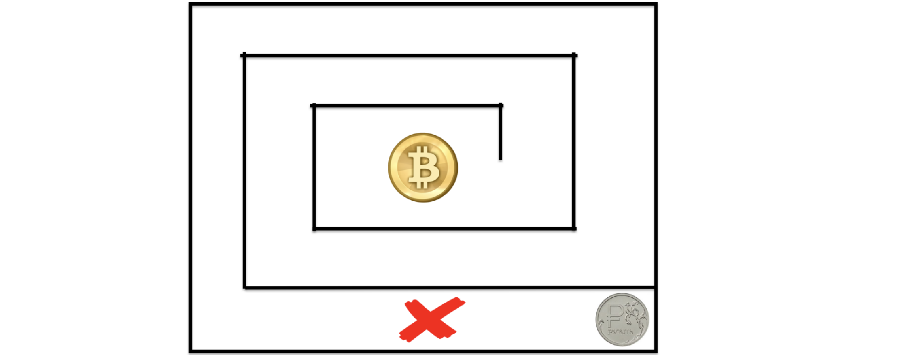
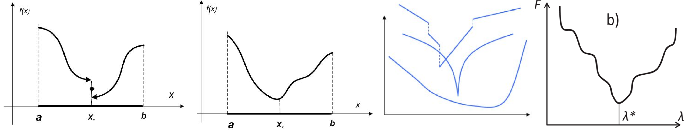
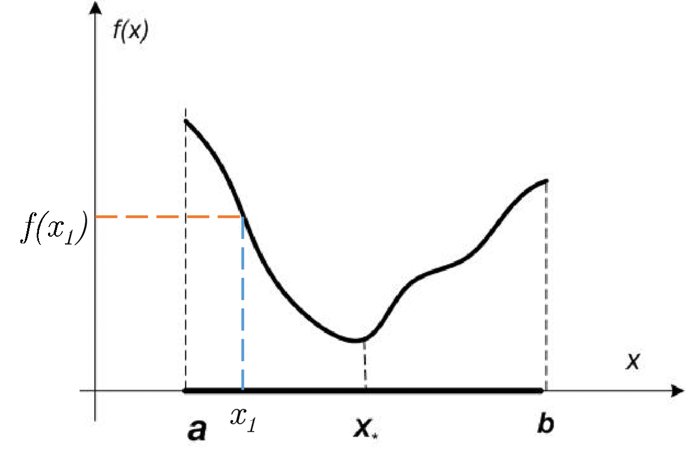
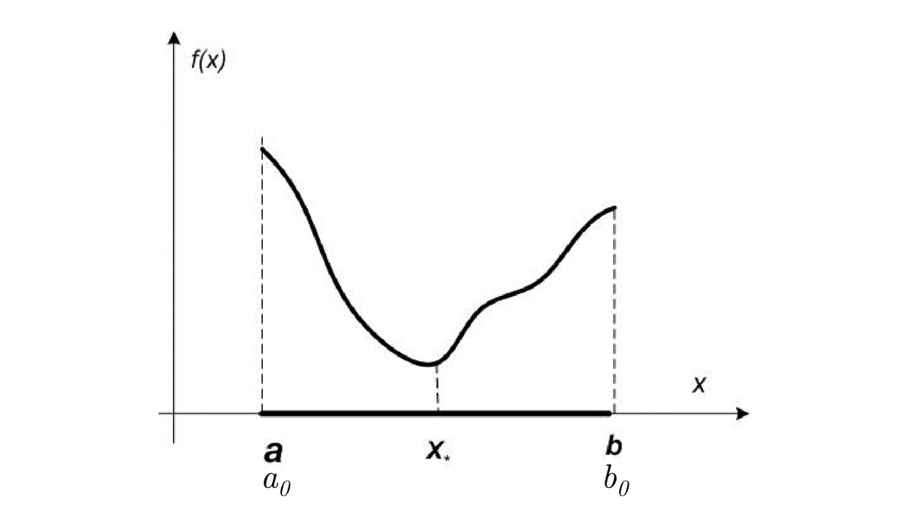

# Методы Оптимизации. Даниил Меркулов. Введение в численные методы. Методы одномерной минимизации

## Структура работы в семестре
### Система оценивания

Полученный рейтинг дает лишь ориентир для выставления итоговой оценки за семестр. Я оставляю за собой право изменять эту оценку в произвольном диапазоне на свое усмотрение. 
Все новости курса по-прежнему, публикуются в [телеграм канале](https://t.me/mipt_optimization)

### Важный момент:
Часть заданий будет проверяться в автоматическом режиме (готовьтесь к кодерским таскам).


## Численные методы. Зачем нужны и откуда взялись?
### Общая постановка
Решаем общую задачу математического программирования:

$$
\begin{split}
& \min_{x \in \mathbb{R}^n} f(x)\\
\text{s.t. }  g_i(x) \leq& 0, \; i = 1,\ldots,m\\
 h_j(x) =& 0, \; j = 1,\ldots,k\\
\end{split}
$$

### Теоретические результаты
* Необходимое условие первого порядка: если $x^*$ точка локального минимума дифференцируемой функции $f(x)$, тогда
$$
f′(x^*)=0
$$
* Необходимое условие второго порядка: если $x^*$ точка локального минимума дважды дифференцируемой функции $f(x)$, тогда
$$
f′(x^*)=0, \qquad \qquad\qquad f′′(x^*) \succeq 0,
$$
* Достаточное условие: пусть $f(x)$ дважды дифференцируемая выпуклая функция, и пусть точка $x^*$ удовлетворяет условиям
$$
f′(x^*)=0, \qquad\qquad\qquad f′′(x^*) \succeq 0,
$$
тогда $x^*$ является точкой строго локального минимума функции $f(x)$.
* Условия Каруша Куна Таккера позволяют решать задачи математического программирования аналитически. 

### Основные проблемы:
* Сформулировать задачу оптимизации в классической форме - де-факто труднейшая часть задачи в реальном мире
* Решать ККТ может быть практически нецелесообразно

## Итерационные методы
### Итеративная природа решения
Как правило, методы генерируют бесконечную последовательность приближенных решений
$$
\{x_t\},
$$
которая за конечное число шагов (а лучше - время) сходится к оптимальному (хотя бы одному из оптимальных) решению $x^*$.


При этом на каждом шаге метод как бы "спрашивает" информацию о локальном поведении функции (её значение в точке $x_t$, градиент, гессиан и т.д.), что позволяет ввести понятие "оракула", как абстрактного устройства, которое отвечает на некоторые вопросы метода. Эта концепция создана для облегчения понимания и формализации происходящего. В то же время, стоит понимать, что внутри черного ящика, выдающего ответы (оракула), как правило, заложен алгоритм вычисления значения функции (её производной или пр.), который так же занимает какое то время

### Общая схема
Дано: начальное приближение $x$, требуемая точность $\varepsilon$.

```python
def GeneralScheme(x, epsilon):
    while StopCriterion(x) > epsilon:
        OracleResponse = RequestOracle(x)
        UpdateInformation(I, x, OracleResponse)
        x = NextPoint(I, x)
    return x
```

## Проблемы
### Критерий остановки
* Сходимость по аргументу: 
$$
\| x_k - x^*  \|_2 < \varepsilon
$$ 
* Сходимость по функционалу: 
$$
\| f_k - f^* \|_2 < \varepsilon
$$ 
* Выполнение необходимого условия для дифференцируемой функции 
$$
\| f'(x_k) \|_2 < \varepsilon
$$

Но ведь $x^*$ и $f^* = f(x^*)$ неизвестны!

Супер лайфхак
$$
\|x_{k+1} - x_k \| = \|x_{k+1} - x_k + x^* - x^* \| \leq \|x_{k+1} - x^* \| + \| x_k - x^* \| \leq 2\varepsilon
$$

**Замечание**: лучше использовать относительные изменения этих величин! Например $\dfrac{\|x_{k+1} - x_k \|_2}{\| x_k \|_2}$


### Локальная природа поведения методов


## Классификация задач
### Условная и безусловная
* Безусловная задача оптимизации 
$$
\min_{x \in \mathbb{R}^n} f(x)
$$
Далее на функцию $f(x)$ накладываются ограничения (линейность, непрерывность, липшициевость, выпуклость, унимодальность, и т.д.). Несмотря на то, что в реальной жизни они встречаются существенно реже, их изучение очень важно с точки зрения строительных блоков для решения условных задач.
* Условная задача 

    Содержит хотя бы одно равенство или неравенство вдобавок к вышенаписанному. Такие задачи сложнее, но гораздо чаще встречаются в реальной жизни

### Линейная и нелинейная
Если все функции, указанные в общей постановке - линейные - мы имеем дело с задачей линейного программирования или с задачей линейной оптимизации. Заметим, что люди научились сражаться с задачами линейного программирования (в следующих сериях). Поэтому особый интерес представляют задачи нелинейной оптимизации.

### Выпуклая и невыпуклая
Общая задача математического программирования называется выпуклой, если функции $f(x)$ и $g_i, i = 1, \ldots, m$ выпуклы, в то время как $h_j$, если есть, линейны.
Для выпуклых задач разработаны методы, обладающие хорошей вычислительной сложностью, приемлимым числом итераций для достижения гарантированной точности даже в общем случае. Выпуклая оптимизация, в целом, шагнула сильно дальше общей теории нелинейной оптимизации с точки зрения практических результатов. Однако, нельзя ограничиться только ими, так как в жизни полно невыпуклых задач.

## Классификация методов

### По типу оракула
* Методы нулевого порядка: оракул возвращает только значение функции $f(x)$
* Методы первого порядка: оракул возвращает значение функции $f(x)$ и её градиент $f'(x)$
* Методы второго порядка: оракул возвращает значение функции $f(x)$, её градиент $f'(x)$ и гессиан $f''(x)$.

### По скорости сходимости

* Сублинейная
$$
\| x_{k+1} - x^* \|_2 \leq C k^{\alpha},
$$
где $\alpha < 0$ и $ 0 < C < \infty$

* Линейная
$$
\| x_{k+1} - x^* \|_2 \leq Cq^k \qquad\qquad\qquad \text{или} \qquad\qquad\qquad \| x_{k+1} - x^* \|_2 \leq C\| x_k - x^* \|_2
$$
где $q \in (0, 1)$ и $ 0 < C < \infty$

* Сверхлинейная 
$$
\| x_{k+1} - x^* \|_2 \leq Cq^{k^2} \qquad\qquad\qquad \text{или} \qquad\qquad\qquad \| x_{k+1} - x^* \|_2 \leq C_k\| x_k - x^* \|_2
$$
где $q \in (0, 1)$ и $ 0 < C_k < \infty$, $C_k \to 0$

* Квадратичная
$$
\| x_{k+1} - x^* \|_2 \leq C q^{2^k} \qquad\qquad\qquad \text{или} \qquad\qquad\qquad \| x_{k+1} - x^* \|_2 \leq C\| x_k - x^* \|^2_2
$$
где $q \in (0, 1)$ и $ 0 < C < \infty$


```python
%matplotlib inline
import matplotlib.pyplot as plt
import seaborn
import numpy as np

C = 10
alpha = -0.5
q = 0.9
num_iter = 200
sublinear = np.array([C * k**alpha for k in range(1, num_iter + 1)])
linear = np.array([C * q**k for k in range(1, num_iter + 1)])
superlinear = np.array([C * q**(k**2) for k in range(1, num_iter + 1)])
quadratic = np.array([C * q**(2**k) for k in range(1, num_iter + 1)])
plt.figure(figsize=(12,8))
plt.semilogy(np.arange(1, num_iter+1), sublinear, 
             label=r"Sublinear, $\alpha = -0.5$")
plt.semilogy(np.arange(1, num_iter+1), superlinear, 
             label=r"Superlinear, $q = 0.5$")
plt.semilogy(np.arange(1, num_iter+1), linear, 
             label=r"Linear, $q = 0.5$")
plt.semilogy(np.arange(1, num_iter+1), quadratic, 
             label=r"Quadratic, $q = 0.5$")
plt.xlabel("Number of iteration, $k$", fontsize=24)
plt.ylabel("Error rate upper bound", fontsize=24)
plt.legend(loc="best", fontsize=20)
plt.xticks(fontsize = 20)
_ = plt.yticks(fontsize = 20)
```


## Как определить скорость сходимости?

### Тест корней.

Пусть $\{r_k\}_{k=m}^\infty$ — последовательность неотрицательных чисел,
сходящаяся к нулю, и пусть $$ \alpha = \lim_{k \to \infty} \sup \;\; r_k ^{1/k}$$

* Если $0 \leq \alpha \lt  1$, то $\{r_k\}_{k=m}^\infty$ имеет линейную сходимость с константной $\alpha$. 
* В частности, если $\alpha = 0$, то $\{r_k\}_{k=m}^\infty$ имеет сверхлинейную сходимость.
* Если $\alpha = 1$, то $\{r_k\}_{k=m}^\infty$ имеет сублинейную сходимость. 
* Случай $\alpha \gt 1$ невозможен.

### Тест отношений

Пусть $\{r_k\}_{k=m}^\infty$ — последовательность строго положительных чисел, сходящаяся к нулю. Пусть
$$
\alpha = \lim_{k \to \infty} \dfrac{r_{k+1}}{r_k}
$$
* Если существует $\alpha$ и при этом $0 \leq \alpha \lt  1$, то $\{r_k\}_{k=m}^\infty$ имеет линейную сходимость с константой $\alpha$
* В частности, если $\alpha = 0$, то $\{r_k\}_{k=m}^\infty$ имеет сверхлинейную сходимость
* Если $\alpha$ не существует, но при этом $q = \lim_{k \to \infty} \sup \dfrac{r_{k+1}}{r_k} \lt  1$, то $\{r_k\}_{k=m}^\infty$ имеет линейную сходимость с константой, не превосходящей $q$. 
* Если $ \lim_{k \to \infty} \inf \dfrac{r_{k+1}}{r_k} =1$, то $\{r_k\}_{k=m}^\infty$ имеет сублинейную сходимость. 
* Ситуация $ \lim_{k \to \infty} \inf \dfrac{r_{k+1}}{r_k} \gt 1$ невозможна. 
* Во всех остальных случаях (т. е. когда $ \lim_{k \to \infty} \inf \dfrac{r_{k+1}}{r_k} \lt  1 \leq  \lim_{k \to \infty} \sup \dfrac{r_{k+1}}{r_k}$) нельзя утверждать что-либо конкретное о скорости сходимости $\{r_k\}_{k=m}^\infty$

## Методы одномерной минимизации
### Что и зачем?
$$
f^* = \min_{x \in S} f(x),
$$
причем $x \in \mathbb{R}, \;\;S = [a, b]$. Часто предполагается, что функция $f(x)$ непрерывна на компакте $S$. 

Данная задача является одной из наиболее простых формальных задач оптимизации, тем не менее, она является важным звеном в решении более сложных задач, поэтому очень важно эффективно ее решать. Ограничим класс рассматриваемых задач при которых $f(x)$ является *унимодальной функцией*.

Функция $f(x)$ называется **унимодальной** на $[a, b]$, если существует $x_* \in [a, b]$, что $f(x_1) > f(x_2) \;\;\; \forall a \le x_1 < x_2 < x_*$ и $f(x_1) < f(x_2) \;\;\; \forall x_* \le x_1 < x_2 < b$ 


### Лемма, на которой основаны все методы одномерного поиска
Пусть $f(x)$ унимодальная функция на $[a, b]$. Тогда если $x_1 < x_2 \in [a, b]$, то:
* если $f(x_1) \leq f(x_2) \to x_* \in [a, x_2]$
* если $f(x_1) \geq f(x_2) \to x_* \in [x_1, b]$


### Метод Дихотомии
#### Идея
Делим отрезок на две равные части и выбираем по значению функций тот из них, который содержит решение задачи. 
#### Алгоритм
```python
def binary_search(f, a, b, epsilon):
    c = (a + b) / 2
    while abs(b - a) > epsilon:
        y = (a + c) / 2.0
        if f(y) <= f(c):
            b = c
            c = y
        else:
            z = (b + c) / 2.0
            if f(c) <= f(z):
                a = y
                b = z
            else:
                a = c
                c = z
    return c
```


#### Оценки
Величина отрезка на $k+1$ ой итерации:
$$
\Delta_{k+1} = b_{k+1} - a_{k+1} = \dfrac{1}{2^k}(b-a)
$$
Для унимодальных функций при выборе середины отрезка справедливо: 
$$
|x_{k+1} - x_*| \leq \dfrac{\Delta_{k+1}}{2} \leq \dfrac{1}{2^{k+1}}(b-a) \leq (0.5)^{k+1} \cdot (b-a)
$$
Обозначая правую часть последнего неравенства за $\varepsilon$, получаем число итераций метода, необходимых для достижения $\varepsilon$ точности:
$$
K = \left\lceil \log_2 \dfrac{b-a}{\varepsilon} - 1 \right\rceil
$$

### Метод Золотого Сечения
#### Идея
Аналогично Дихотомии, но делить отрезок $[a,b]$ не на две равные насти, а в пропорции "золотого сечения", т.е. найти такую точку $c \in [a, b]: \frac{c-a}{b-c} = \frac{b-a}{c-a}$
#### Алгоритм
```python
def golden_search(f, a, b, epsilon):
    tau = (sqrt(5) + 1) / 2
    y = a + (b - a) / tau**2
    z = a + (b - a) / tau
    while b - a > epsilon:
        if f(y) <= f(z):
            b = z
            z = y
            y = a + (b - a) / tau**2
        else:
            a = y
            y = z
            z = a + (b - a) / tau
    return (a + b) / 2
```
#### Оценки
$$
|x_{k+1} - x_*| \leq b_{k+1} - a_{k+1} = \left( \frac{1}{\tau} \right)^{N-1} (b - a) \approx 0.618^k(b-a),
$$
где $\tau = \frac{\sqrt{5} + 1}{2}$.

* Константа геометрической прогрессии **больше**, чем у метода дихотомии - $0.618$ хуже, чем $0.5$
* Количество вызовов функции **меньше**, чем у метода дихотомии - $0.707$ хуже, чем $0.618$ - (на каждой итерации метода дихотомии, кроме первой функция вычисляется не более 2х раз, а в методе золотого сечения - не более одного)

### Сравнение методов


```python
%matplotlib inline
def binary_search(f, a, b, epsilon, callback=None):
    c = (a + b) / 2.0
    while abs(b - a) > epsilon:
#         Check left subsegment
        y = (a + c) / 2.0
        if f(y) <= f(c):
            b = c
            c = y
        else:
#         Check right subsegment
            z = (b + c) / 2.0
            if f(c) <= f(z):
                a = y
                b = z
            else:
                a = c
                c = z
        if callback is not None:
            callback(a, b)
    return c

def my_callback(a, b, left_bound, right_bound, approximation):
    left_bound.append(a)
    right_bound.append(b)
    approximation.append((a + b) / 2.0)
    
    
# %matplotlib inline
import numpy as np
import matplotlib.pyplot as plt
import seaborn

left_boud_bs = []
right_bound_bs = []
approximation_bs = []

callback_bs = lambda a, b: my_callback(a, b, 
            left_boud_bs, right_bound_bs, approximation_bs)

# Target unimodal function on given segment
f = lambda x: (x - 2) * x * (x + 2)**2 # np.power(x+2, 2)
# f = lambda x: -np.sin(x)
x_true = -2
# x_true = np.pi / 2.0
a = -3
b = 2.5
epsilon = 1e-8
x_opt = binary_search(f, a, b, epsilon, callback_bs)

plt.figure(figsize=(10,6))
plt.plot(np.linspace(a,b), f(np.linspace(a,b)))
plt.title("Objective function", fontsize=18)


def golden_search(f, a, b, tol=1e-5, callback=None):
    tau = (np.sqrt(5) + 1) / 2.0
    y = a + (b - a) / tau**2
    z = a + (b - a) / tau
    while b - a > tol:
        if f(y) <= f(z):
            b = z
            z = y
            y = a + (b - a) / tau**2
        else:
            a = y
            y = z
            z = a + (b - a) / tau
        if callback is not None:
            callback(a, b)
    return (a + b) / 2.0

left_boud_gs = []
right_bound_gs = []
approximation_gs = []

cb_gs = lambda a, b: my_callback(a, b, left_boud_gs, right_bound_gs, approximation_gs)
x_gs = golden_search(f, a, b, epsilon, cb_gs)

print(f(x_opt))
print(f(x_gs))
print(np.abs(x_opt - x_true))

plt.figure(figsize=(10,6))
plt.semilogy(np.arange(1, len(approximation_bs) + 1), np.abs(x_true - np.array(approximation_bs, dtype=np.float64)), label="Binary search")
plt.semilogy(np.arange(1, len(approximation_gs) + 1), np.abs(x_true - np.array(approximation_gs, dtype=np.float64)), label="Golden search")
plt.xlabel(r"Number of iteration, $k$", fontsize=20)
plt.ylabel("Error rate upper bound", fontsize=18)
plt.legend(loc="best", fontsize=20)
plt.xticks(fontsize = 20)
_ = plt.yticks(fontsize = 20)
```

    6.93889390875399e-18
    -9.914949590828147
    9.313225746154785e-10


```python
%timeit binary_search(f, a, b, epsilon)
%timeit golden_search(f, a, b, epsilon)
```

    65.2 µs ± 7.64 µs per loop (mean ± std. dev. of 7 runs, 10000 loops each)
    187 µs ± 13.7 µs per loop (mean ± std. dev. of 7 runs, 10000 loops each)


```python
f = lambda x: np.sin(np.sin(np.sin(np.sqrt(x))))
x_true = (3 * np.pi / 2)**2
a = 2
b = 60
epsilon = 1e-8
plt.figure(figsize=(10,6))
plt.plot(np.linspace(a,b), f(np.linspace(a,b)))
plt.title("Objective function", fontsize=18)

left_boud_bs = []
right_bound_bs = []
approximation_bs = []

callback_bs = lambda a, b: my_callback(a, b, 
            left_boud_bs, right_bound_bs, approximation_bs)

x_opt = binary_search(f, a, b, epsilon, callback_bs)
print(np.abs(x_opt - x_true))

left_boud_gs = []
right_bound_gs = []
approximation_gs = []

cb_gs = lambda a, b: my_callback(a, b, left_boud_gs, right_bound_gs, approximation_gs)
x_gs = golden_search(f, a, b, epsilon, cb_gs)

print(np.abs(x_opt - x_true))

plt.figure(figsize=(8,6))
plt.semilogy(np.abs(x_true - np.array(approximation_bs, dtype=np.float64)), label="Binary")
plt.semilogy(np.abs(x_true - np.array(approximation_gs, dtype=np.float64)), label="Golden")
plt.legend(fontsize=16)
plt.xticks(fontsize=20)
_ = plt.yticks(fontsize=20)
```

    9.81513963438374e-08
    9.81513963438374e-08


```python
%timeit binary_search(f, a, b, epsilon)
%timeit golden_search(f, a, b, epsilon)
```

    627 µs ± 5.69 µs per loop (mean ± std. dev. of 7 runs, 1000 loops each)
    667 µs ± 77.5 µs per loop (mean ± std. dev. of 7 runs, 1000 loops each)

